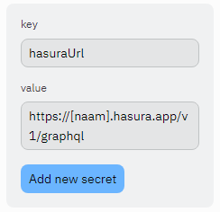

# MI-X 2.2: Project  
**In het project realiseer je een informatiesysteem voor de casus van je projectgroep. De casussen zijn apart beschreven, de generieke eisen en wensen waaraan het informatiesysteem moet voldoen zijn voor alle groepen gelijk. Het systeem dat je ontwikkelt omvat een database en een gebruikersinterface.**

Via Replit kun je samen de gebruikersinterface bouwen.

## Project starten

### Secrets opslaan
Het "exposen" van API keys of bepaalde URLs in de frontend in JavaScript is een enorm veiligheidsrisico. Als je dat voor je Hasura-connectie doet kan iedereen uit je code de toegangsinformatie halen en je connectie misbruiken. 
Daarom slaan we deze 'secrets' op in Replit als _System environment variables_ die de Java-code weer kan gebruiken. 

* Ga naar Secrets in de linkerbalk. 
* Voeg je secrets toe  
  * Doe dit voor `hasuraUrl`
  * Doe dit voor `hasuraApiKey` 
  * Doe dit voor `postcodeApiKey`, zie Canvas voor de API key

De Java-code vind je onder `src/main/java/nl/mi_x/catch22`.

De HTML- en de JavaScript-code vind je onder `src/main/resources/static`.

### Indeling van de mappenstructuur
Dit Replit-project bestaat uit Java-code (de backend) en HTML-, CSS-, en JavaScript-code (de frontend). 

De backend-code vind je in `src/main/java/nl/mi_x/catch22/`, de frontend-code in `src/main/resources/static/`.

## Frontend-code
De frontend-map bevat een html-pagina, met wat JavaScript erin. Deze vind je onder `src/main/resources/static`. Alle bestanden die je in deze map zet, worden onder de / (root) URL van de server beschikbaar.

De frontend is gebaseerd op [Bootstrap](https://getbootstrap.com/docs/5.2/getting-started/introduction/), een toolkit die ervoor zorgt dat je snel en makkelijk een mooie frontend kan maken. In de [Docs van Bootstrap](https://getbootstrap.com/docs/5.2/getting-started/introduction/) kun je voorbeeldcode vinden die je helpt om bijvoorbeeld een [formulier](https://getbootstrap.com/docs/5.2/forms/overview/) of een [navigatiebalk](https://getbootstrap.com/docs/5.2/components/navbar/) te maken. Ook kun je via dezelfde Docs veel [voorbeeld web apps met bijbehorende code](https://getbootstrap.com/docs/5.2/examples/) vinden.

## Backend-code

De backend bestaat uit een service die wordt gemaakt met behulp van SpringBoot. Dit biedt een makkelijk server-framework. Maar je kunt een server op allerlei manieren opzetten.
De java-code van de service vind je onder `src/main/java/nl/mi_x/catch22`.

* `ServerApplication.java` - Dit is het bestand waarmee de SpringBoot application wordt gestart.
* `APIController.java` - Deze (super)class levert een method `getApiCallResponse` die een API-call doet naar een server en het resultaat hiervan teruggeeft. Je geeft hiervoor een `HttpURLConnection` mee als parameter.
* `HasuraApiController.java` - Deze class zorgt voor de communicatie met Hasura:
  * De `@GetMapping` directives geven aan welke URLs de eronder gegeven functie aanroepen. In deze class is dat dus 
 `@GetMapping("/hasura")`.
  * Als je `/hasura` achter de URL van jouw Repl zet (`[naam].mi-x-22.repl.co`), dan kun je met behulp van de `query` query parameter een GraphQL query meegeven.
* `PostcodeApiController.java` - Deze class is een voorbeeld van hoe je een API endpoint kan maken
  * De `@GetMapping` directives geven aan welke URLs de eronder gegeven functie aanroepen. In deze class is dat dus 
 `@GetMapping("/postcode")`.
  * Met `@RequestParam` kun je aangeven welke query parameters meegegeven kunnen worden (`value = "postcode"`), wat hun standaardwaarde is als ze niet zijn meegegeven (`defaultValue = "110AZ"`) en wat de naam van de variabele is die je in de class kunt gebruiken (`String postcode`).
    * In deze class zijn dat dus `postcode` en `huisnummer`:
    * `@RequestParam(value = "postcode", defaultValue = "110AZ") String postcode,`
    * `@RequestParam(name = "huisnummer", defaultValue = "9") String huisnummer`
  * Deze functie wordt aangeroepen in je Javascript van de HTML-pagina: `$.getJSON("/postcode", {
          postcode: postcode,
          huisnummer: huisnummer,
        }`
    * Hier zie je een Ajax request die JSON verwacht (`$.getJSON`), met simpele parameters (postcode, huisnummer).
    * In de backend-code zie je dat deze worden gecombineerd met een api-key, en deze vervolgens naar api.overheid.io worden gestuurd.
    * Bovenstaande geeft dus een manier om een postcode op te vragen bij api.overheid.io, met een api-key, maar deze scherm je af door deze in de java-code te zetten, NIET in de JavaScript. Op een zelfde manier kun je bijvoorbeeld met FHIR/SNOMED-servers communiceren.